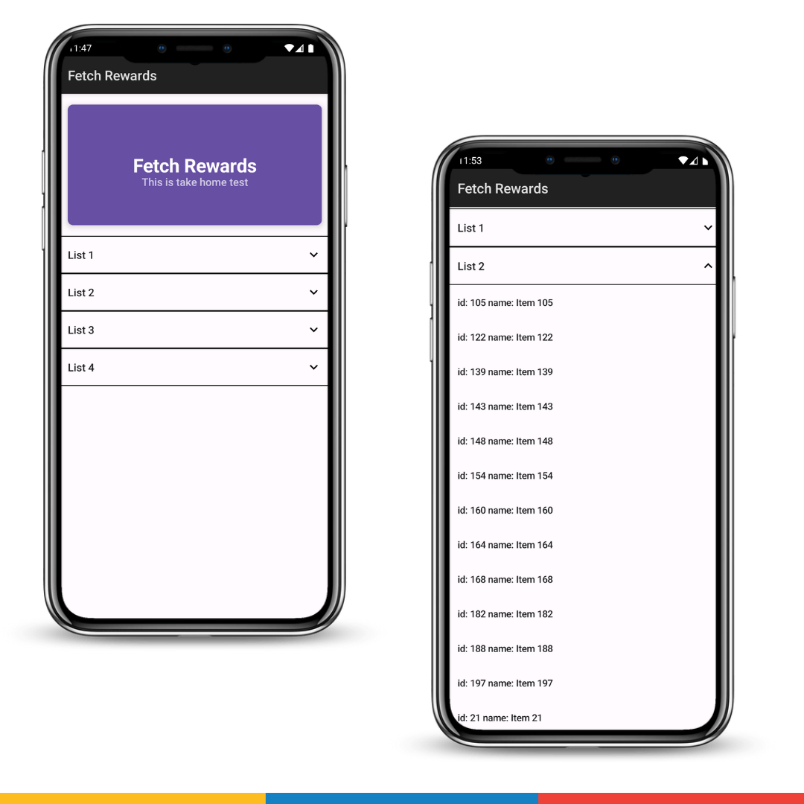

## Fetch Assignment (Android)

### About

Display this list of items to the user based on the following requirements:-

* [x] Display all the items grouped by "listId"
* [x] Sort the results first by "listId" then by "name" when displaying.
* [x] Filter out any items where "name" is blank or null.
* [x] The final result should be displayed to the user in an easy-to-read list.

### Running App

1. Open the folder on Android Studio from the repository
2. Run the app

## Screenshots

